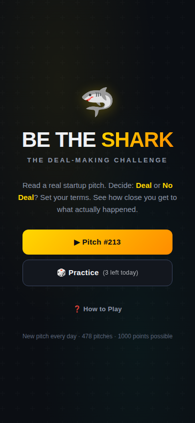

# 🦈 Be The Shark

**A Shark Tank India deal simulator.** Read a real (anonymized) startup pitch — industry, revenue, the founder's ask — and make your call: go out, match the ask, or counter-offer. Then the real outcome is revealed and you're scored on how close your instincts came to the actual deal. Wordle-style daily challenge, built for the show's 10M+ fanbase.

### ▶ [Play it live → be-the-shark.vercel.app](https://be-the-shark.vercel.app)

<p align="center">
  
</p>

## Why I built it

I co-founded a company that pitched on Shark Tank India (Aroleap). Every fan watching the show plays armchair investor — *"I'd have countered at 2%"* — but nobody keeps score. This game does: every day, one real pitch, your call against what actually happened in the tank.

It's also a portfolio piece about **shipping with AI as a non-engineer**: PM review → rebuild from a compiled prototype → data verification pipeline → deploy, built end-to-end with Claude Code. The process artifacts are in the repo ([PM review](docs/PM_REVIEW.md), [objective → failure modes → QC gates plans](docs/PHASE2_PLAN.md)).

## Features

- **Daily pitch** — same pitch for every player worldwide (IST-pinned, timezone-safe), plus 3 practice rounds a day
- **Full deal mechanics** — go out / match the ask / counter with amount + equity sliders and live valuation math
- **Streaks & stats** — current/max streak, score distribution, best score, all local-first
- **Community leaderboard** — opt-in daily top-50 (Supabase free tier; DB-enforced integrity, one submission per browser per day)
- **Share cards** — a generated score-card image attaches to your share (canvas-drawn, zero image libraries), and links unfurl with a branded OG preview

## Scoring (max 1000 per pitch)

| Component | Points | Logic |
|---|---|---|
| Deal call | 300 | Did you correctly predict deal vs. no deal? |
| Amount accuracy | 350 | Linear falloff by % deviation from the actual deal amount (zero at 50% off) |
| Equity accuracy | 350 | Same falloff against the actual equity |

Correctly calling "no deal" on a no-deal pitch earns the full 700 accuracy points. Debt deals score against the equity-cash portion; the debt is disclosed at reveal.

## The data (the hard part)

`data/pitches.json` — **784 real pitches across all five seasons** (428 deals / 356 no-deals), schema v2 with per-record provenance:

- Seasons 1–3 cross-verified against public episode tables by a rowspan-aware parser — the audit surfaced **57 hidden debt deals**, a record that showed a deal that actually happened *after* the show (JhaJi Achaar), and a royalty misrecorded as equity
- Seasons 4–5 (310 pitches) parsed directly from public episode tables with a **round-trip check (0 mismatches)** and explicit exclusion logging — no silent drops
- 79 deals carry their real **debt components**; royalty and split structures shown at reveal
- Symbolic stunt asks (Cocofit's ₹5, Watt's ₹101, Dharaksha's ₹1,250) are excluded by policy: real episodes, but meaningless to score on amount/equity
- A **validator runs with the test suite**: plausibility bounds, name-leak checks against descriptions, shark-key integrity, no-deal field hygiene — bad data can't ship
- The **daily schedule is pinned** (`src/data/dailyOrder.json`): dataset growth appends to the end of the cycle, and a hash-locked test guarantees days players have already seen never reshuffle

Company and founder names are hidden during play (anti-cheat) and revealed after you commit. Deal facts are public information; pitch descriptions are original writing.

## Tech

Vite + React + TypeScript + Tailwind + framer-motion, fully static on Vercel — the game itself needs no backend. Supabase (free tier) powers only the community leaderboard, with plain-`fetch` PostgREST calls (no SDK) and quiet degradation: if the backend is down, the game doesn't care. **46 unit tests** cover scoring math, timezone-safe daily selection, streak day-boundary edges, the leaderboard client, and the data validator.

```bash
npm install
npm run dev    # play locally
npm test       # 46 tests: scoring, daily determinism, streaks, data QA
```

## Repo guide

- `src/` — app source; game logic in `src/lib/` (scoring, daily pitch, storage, leaderboard, share card)
- `data/pitches.json` — canonical dataset (schema v2: debt, provenance, verification flags)
- `scripts/` — data validator (runs in CI), build-time name obfuscation, pinned-schedule maintenance
- `docs/` — [PM review](docs/PM_REVIEW.md) · [phase plans with QC gates](docs/PHASE2_PLAN.md) · [product plan](docs/PROJECT_PLAN.md)
- `prototype/index.html` — the original compiled v6 prototype, kept as the visual spec

## Roadmap

Season Mode (play a whole season, track your portfolio) · Head-to-Head via share link · Speed Round · "Which shark do you invest like?" profile.

---

*Not affiliated with Shark Tank India or Sony Pictures. Built on publicly available deal data.*
